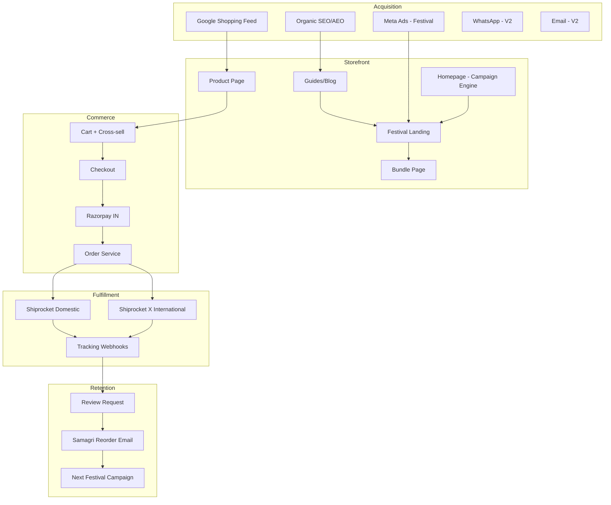

# Go-To-Market & End-to-End Commerce Strategy
## Global Puja & Spiritual E-Commerce Platform

> Research-backed operating plan. Updated: Aug 2026.
> Markets: IN, US, UK, CA, AU, AE, SG, NZ, EU | Payments: Razorpay (IN) | Fulfillment: Shiprocket + Shiprocket X

---

## Executive Summary

India's **₹40,000 Cr puja needs market** is ~50% organized and rapidly digitizing. Winners combine **trust + convenience + kits/bundles + festival merchandising + diaspora clarity**. Our differentiation: honest pricing, transparent specs, dual Hindu/Jain prominence, international-first product language, and education-led SEO/AEO — not cheap discount positioning.

**Revenue model flywheel:**
```
Organic/AI Search → Guide/Festival Page → Kit/Bundle → Repeat Samagri → Review → Referral
Paid (Meta/Google) → Hero Kit PDP → Cross-sell → WhatsApp retention → Festival reorder
```

---

## 1. Competitive Landscape (How They Sell)

### Tier 1 — Legacy omnichannel (trust + breadth)
| Brand | Model | What works | Gap we exploit |
|-------|-------|------------|----------------|
| **Giri Trading** (~₹100Cr) | 40 stores + giri.in + Amazon + diaspora stores US/UK/AU/UAE | Incense + idols drive revenue; English transliteration books for diaspora; festival collections | Dated UX; weak intl shipping transparency; pricing opaque on premium brass |
| **Isha Life** | Spiritual brand extension | Premium positioning, content authority | Higher price; narrower puja samagri focus |

### Tier 2 — D2C organized samagri (convenience + packaging)
| Brand | Model | What works | Gap we exploit |
|-------|-------|------------|----------------|
| **OM Bhakti** (FAST42, ₹20Cr+ FY26 target) | Q-commerce + modern trade + 1,500 stores | Tamper-proof packaging, 12hr batti, Zepto/Blinkit impulse | Consumables-only; limited brass/idols/kits on own site |
| **Divine Hindu** (~₹100Cr ARR) | D2C + marketplaces + q-comm | Festival peaks, premium design, global Amazon planned | Generic spiritual lifestyle; less puja education depth |
| **Phool / Nirmalaya** | Sustainability angle | Eco narrative, temple flower recycling | Not full puja catalogue |

### Tier 3 — Kit & gift specialists
| Brand | Model | What works | Gap we exploit |
|-------|-------|------------|----------------|
| **My Pooja Box** | Curated kits + subscription samagri | High AOV gifts, monthly replenishment | Premium/luxury skew; weak brass specs |
| **Bharat Puja & Gifts (USA)** | Diaspora one-stop | Clear US positioning, copper/brass/silver | Limited festival engine, thin guides |

### Tier 4 — Marketplaces (discovery, not loyalty)
Amazon.in / Amazon.com / Flipkart — customers compare price; **own-site wins on kits, education, trust, and repeat**.

### Key industry insights
1. **Q-commerce owns impulse** — 10–15 min delivery for forgotten camphor/wicks; we integrate later, launch with Shiprocket 2–5 day IN + intl
2. **Kits beat singles** — "ready-to-use" is top purchase driver (Financial Express, 2026)
3. **Trust is verifiable** — Japam grew on QR lab reports; we use transparent specs + real reviews (no fake social proof)
4. **D2C site = margin + data** — Japam 91% D2C; Svastika 90% D2C; we prioritize own-site over marketplace dependency
5. **Consolidation coming** — 422 funded startups; winners = convenience + cultural relevance + supply chain

---

## 2. Our Positioning vs Competition

| Dimension | Cheap puja shop | Marketplace seller | **Our brand** |
|-----------|-----------------|-------------------|---------------|
| Price | Lowest | Race to bottom | Honest value (MRP + fair price) |
| Discovery | Category-only | Search-only | Purpose + Festival + Guide-led |
| Intl | Afterthought | Slow/shipping unclear | Country stores, duties visible |
| Jain | Ignored or sub-menu | Mixed | Equal navigation & collections |
| Content | Thin | None | Guides rank on Google + AI |
| Bundles | Random | None | Intent-mapped kits (major AOV) |

**Tagline stack (test in order):**
1. "Traditional products. Thoughtfully sourced."
2. "Everything you need for your puja, in one place."
3. "Quality you can see. Prices you can trust."

---

## 3. Customer Segments & Jobs-To-Be-Done

### India
| Segment | Job | Primary entry | Hero product |
|---------|-----|---------------|--------------|
| Daily puja household | Replenish wicks, camphor, oil | Search / Q-comm later | Monthly samagri bundle |
| New home / griha pravesh | Complete setup | Shop by Purpose | New Home Puja Kit |
| Festival shopper | One-stop Diwali/Navratri | Festival landing | Diwali Complete Kit |
| Brass buyer | Quality utensil/idol | Category + Google Shopping | Brass diya, thali |
| Jain family | Specific samagri | Jain collection | Jain Daily Puja Kit |
| Gift buyer | Send meaningful gift | Gifting purpose | Gift sets |

### International diaspora
| Segment | Job | Primary entry | Hero product |
|---------|-----|---------------|--------------|
| US/UK Hindu family | Can't find samagri locally | "puja items USA" SEO | Daily Puja Starter Kit |
| Second-gen learner | Doesn't know terminology | Guides + dual naming | Explainer PDPs |
| Temple/community | Bulk brass, diyas | B2B later | Bulk brass diyas |
| Jain abroad | Jain-specific items | Jain festival pages | Paryushan essentials |

---

## 4. End-to-End Wiring (Systems Map)



### Order lifecycle (V1)
1. **Browse** → country cookie + pricing context
2. **PDP** → shipping estimate (Shiprocket rate API or table fallback)
3. **Cart** → free-shipping progress + 2–3 cross-sells
4. **Checkout** → guest OK, address, Razorpay (IN); intl payment TBD
5. **Payment webhook** → order confirmed → inventory reserved
6. **Admin** → create Shiprocket shipment → AWB → customer email
7. **Delivered** → review request (day 4) → cross-sell (day 10)

---

## 5. Selling Strategies (Proven Patterns)

### A. Bundle-first AOV (primary)
Competitors winning on kits: My Pooja Box, Giri "Traditional Pooja Sets", Divine Hindu festival boxes.

**Our bundle rules:**
- Every festival has 2–3 kits: Essential / Complete / Premium
- Show: individual value | bundle price | you save | item checklist
- Bundle PDP = highest-converting landing for paid ads

**Target AOV:**
| Market | Baseline | With bundle | Festival peak |
|--------|----------|-------------|---------------|
| India | ₹450 | ₹899–1,499 | ₹1,999+ |
| USA | $35 | $65–95 | $120+ |

### B. Cross-sell graph (intent-aware, not random)
```
Brass Diya → Cotton Wicks, Camphor, Puja Thali, Ghee, Brass Bell
Puja Thali → Diya, Roli, Kumkum, Chandan, Akshat, Incense
Ganesh Idol → Ganesh Puja Kit, Modak plate, Incense, Decorative toran
Jain Samai → Jain camphor, wicks, samai oil, aarti thali
Daily samagri → Subscribe prompt (V2)
```

### C. Pricing psychology (avoid fake discounts)
- Show MRP only when real; permanent "70% off" destroys trust
- **Better Value** badge when our price beats marketplaces on comparable quality
- Festival discount: time-boxed 10–15% on kits (not sitewide fake sale)
- Free shipping threshold: IN ₹999 | US $49 | UK £39 | etc.

### D. Festival revenue calendar (60–90 day prep)
Industry data: **Diwali = 25–35% annual revenue** for D2C brands; Dhanteras = highest single day.

| Weeks to festival | Action |
|-------------------|--------|
| -8 to -6 | SEO guides live, collection curated, email list building |
| -5 to -3 | Early bird 10–15%, bundle pages indexed, Meta creative testing |
| -2 | Retargeting 2x, WhatsApp templates approved (V2) |
| Peak week | Dhanteras/Diwali hero, stock +30% on top 3 SKUs |
| +1 week | Clearance on seasonal, review collection, win-back |

### E. Channel strategy (Year 1)

| Channel | V1 | V2 | Role |
|---------|----|----|------|
| Own website | ✅ Primary | Scale | Margin, data, SEO |
| Google Shopping (free listings) | ✅ | Paid PMax | High-intent product capture |
| Organic SEO/AEO | ✅ | Scale | Guides + festival pages |
| Meta Ads | Festival bursts | Always-on | Kit conversion |
| Amazon IN/Global | Optional | Expand | Discovery, not core |
| Q-comm (Blinkit/Zepto) | ❌ | Evaluate | Impulse samagri |
| WhatsApp | Hooks only | Full drip | Cart recovery, COD confirm |

### F. CRO priorities (before scaling ads)
Case study pattern (Divine Mornings): fix CRO before Meta → ROAS 1.5x → 4x.

**V1 CRO checklist:**
- [ ] Mobile checkout ≤ 3 taps to pay
- [ ] Sticky ATC on PDP
- [ ] Shipping cost visible pre-cart (intl critical)
- [ ] Trust bar above fold
- [ ] Bundle savings visible without scroll
- [ ] Guest checkout default
- [ ] COD option India (reduces friction; manage RTO with confirmation V2)

---

## 6. Content & Keyword Strategy

### Keyword architecture (3 layers)

**Layer 1 — Transactional (PDP + category)**
High purchase intent; optimize titles for Google Shopping + organic.

**Layer 2 — Commercial investigation (guides + comparisons)**
"What do I need for…" queries; feed AI Overviews.

**Layer 3 — Informational (blog, care, culture)**
Top-of-funnel; internal link to products.

### India — Priority keywords

| Cluster | Primary keywords | Target page |
|---------|------------------|-------------|
| Puja samagri | puja samagri online, pooja samagri kit, daily puja samagri list | /categories/puja-samagri, guide |
| Brass items | brass diya, brass pooja thali, brass puja items, brass kalash | Category + PDPs |
| Kits | diwali puja kit, navratri puja kit, daily puja starter kit, new home puja kit | Bundles |
| Festival | diwali puja samagri list, lakshmi puja items, ganesh chaturthi puja items | Festival + guides |
| Jain | jain puja samagri, jain pooja items, paryushan puja items | Jain collection |
| Consumables | cotton wicks for diya, camphor for puja, pooja oil, agarbatti | PDPs |

### USA — Priority keywords (different phrasing than India)

| Cluster | Primary keywords | Target page |
|---------|------------------|-------------|
| Diaspora core | puja items usa, indian puja shop usa, hindu puja items online usa | /us/ landing |
| Product dual-name | brass diya oil lamp, puja thali set brass, camphor holder brass kapoor dani | US PDPs |
| Festival | diwali puja items usa, diwali decoration and puja kit | /us/festivals/diwali |
| Setup | home temple setup items, mandir essentials list | Guide |
| Gifts | indian spiritual gifts usa, diwali gift hamper usa | Collections |

### UK / CA / AU / AE — Pattern
Same structure as US with `en-GB`, `en-CA`, `en-AU`, `en-AE` hreflang. Research per-market phrasing:
- UK: "puja thali set uk", "indian prayer items uk"
- CA: "diwali puja kit canada"
- AU: "hindu puja items australia"
- UAE: "puja items dubai delivery"

### Hindi / transliteration search synonyms (search index)
```
diya = deepak, deep, lamp
agarbatti = incense sticks
kumkum = sindoor (context-dependent)
roli = red powder puja
akshat = rice puja
samai = oil lamp jain
kapoor dani = camphor holder
kalash = puja pot vessel
murti = idol statue
```

### Guide content queue (launch + 90 days)

| Priority | Title | Target query | Links to |
|----------|-------|--------------|----------|
| P0 | Diwali Puja Samagri List (Complete Checklist) | diwali puja samagri list | Diwali kit, diyas, thali |
| P0 | Daily Puja Items List for Home Mandir | daily puja items list | Daily kit, samagri |
| P0 | What Is a Brass Diya? Uses & Types | brass diya, what is diya | Brass diya PDPs |
| P0 | Puja Samagri for USA — Buying Guide | puja samagri usa | /us/ collection |
| P1 | Lakshmi Puja Items — Complete List | lakshmi puja samagri | Lakshmi kit |
| P1 | Brass vs Copper Puja Items | brass vs copper puja | Categories |
| P1 | New Home Puja Essentials (Griha Pravesh) | griha pravesh puja items | New home kit |
| P1 | Jain Daily Puja Items Explained | jain puja samagri list | Jain collection |
| P1 | How to Clean Brass Puja Items | clean brass diya | Brass care + products |
| P2 | Navratri Puja Essentials | navratri puja items | Navratri festival |
| P2 | Ganesh Chaturthi Puja Guide | ganesh chaturthi puja samagri | Ganesh kit |
| P2 | How to Set Up a Home Temple Abroad | home temple setup | Mandir collection |

### AEO answer format (every guide H2)
```markdown
## What items are needed for Lakshmi Puja?

**Short answer:** A complete Lakshmi Puja requires [list 8–10 items in one sentence].

### Complete checklist
| Item | Purpose | Shop |
|------|---------|------|
| Brass diya | Light lamp | [link] |
...
```

---

## 7. Google Shopping Strategy

### Feed setup (V1)
- Auto-generate XML from product DB → Google Merchant Center
- `identifier_exists: false` for unbranded brass/samagri (avoid disapprovals)
- `google_product_category`: Home & Garden > Religious & Ceremonial > Religious Items

### Title formula (feed = keywords)
```
{Material} {Product Type} — {Use Case} | {Indian Name} | {Brand}
```
Examples:
- `Brass Diya Oil Lamp — Daily Puja & Diwali | Deepak | MyPavitra`
- `Puja Thali Set Brass — Complete Pooja Plate with Bowls | MyPavitra`
- `Camphor Holder Brass — Kapoor Dani for Aarti | MyPavitra`

### Custom labels (margin-based bidding V2)
- `label0`: margin_tier (high/medium/low)
- `label1`: festival (diwali/navratri/evergreen)
- `label2`: market (IN/US/UK)

### Hero SKUs for Shopping first wave (50 products)
Brass diya, puja thali set, camphor holder, brass bell, kalash, cotton wicks, puja kit daily, diwali kit, incense holder, ganesh idol small, jain samai, copper lota, akhand diya, pancha patra, agarbatti premium.

---

## 8. Paid Marketing Playbook

### Meta Ads (festival-led)
**Do not scale until CRO baseline ≥2% conversion rate.**

| Funnel stage | Audience | Creative | Offer |
|--------------|----------|----------|-------|
| TOF | Interest: Diwali, Hinduism, Indian culture + LLA | UGC unboxing kit | Education-led |
| MOF | Site visitors 30d, guide readers | Carousel of kit contents | 10% early bird |
| BOF | ATC abandoners, kit viewers | Static + savings overlay | Free shipping |

**Creative angles that work (category pattern):**
- Kit flat-lay with checklist overlay
- "Everything in one box" stop-scroll
- Diaspora: "Ships to USA in 10–12 days"
- Size reference photo (reduces returns — top brass category complaint)

### Google Ads
- **V1:** Free Shopping listings only
- **V2:** Performance Max on hero kits + top 20 PDPs
- **Search (brand + high intent):** "puja kit online", "brass diya buy"

### WhatsApp (V2 — architecture ready V1)
Priority sequences (Diwali playbook):
1. Abandoned cart (hour 1, 24, 48)
2. COD confirmation (India)
3. Post-purchase review request
4. Festival early access for repeat buyers

---

## 9. Shiprocket Integration Plan

### Domestic (India)
- Rate calculator API at cart/checkout
- Auto AWB generation post-payment
- Webhook: pickup → in transit → delivered
- COD support (India)

### International (Shiprocket X)
- Endpoints: `/v1/external/international/shipments/create/forward-shipment`
- Required: HSN codes on products, weight/dimensions, purpose_of_shipment, currency
- Markets: US (10–12 days), UK, CA, AU, UAE, SG, NZ, EU
- PDP shows: "Ships to USA · Est. 10–12 business days · Duties may apply"

### Product master data for shipping
Every variant must have: weight_g, length_cm, width_cm, height_cm, hsn_code, country_restrictions[]

---

## 10. Festival Marketing Calendar 2026–27

| Festival | Approx 2026 | Prep start | Hero offer | Primary collection |
|----------|-------------|------------|------------|------------------|
| Makar Sankrati | Jan 14 | Dec | Regional kits | Light |
| Mahashivratri | Feb 15 | Jan | Rudraksha, bilva | Medium |
| Holi | Mar 3 | Feb | Gifts | Light |
| Ram Navami | Mar 27 | Mar | Samagri | Light |
| Akshaya Tritiya | Apr 20 | Apr | Brass/copper | **High** |
| Mahavir Jayanti | Apr 11 | Mar | Jain collection | **High** (Jain) |
| Raksha Bandhan | Aug 28 | Aug | Gifts | Medium |
| Ganesh Chaturthi | Sep 7 | Aug | Idols + kits | **High** |
| Paryushan | Aug/Sep | Jul | Jain essentials | **High** (Jain) |
| Navratri | Oct 2–10 | Sep | Devi kits, golu | **High** |
| Dhanteras | Nov 6 | Oct | Brass/copper | **Peak** |
| Diwali | Nov 8–12 | Sep 1 | Complete kits | **PEAK** |

**Diwali 90-day checklist:** See Section 5F — start SEO content Sep 1 for Nov peak.

---

## 11. Analytics & KPIs

### North star metrics
| Metric | M6 target | M12 target |
|--------|-----------|------------|
| Own-site revenue | ₹25L/mo | ₹1Cr/mo |
| International % | 15% | 25% |
| Bundle attach rate | 18% | 25% |
| Repeat purchase (90d) | 20% | 30% |
| Organic traffic share | 30% | 45% |
| CAC payback | <2 orders | <1.5 orders |

### Event tracking (see ANALYTICS.md)
All events include: `country`, `currency`, `festival_campaign`, `utm_*`

---

## 12. AI Image/Video Pipeline

```
Reference photo (supplier) → AI generation (hero, lifestyle, scale, detail)
                          → Human QA (dimensions match, respectful deity depiction)
                          → CDN upload with alt text (SEO + accessibility)
```

**QA reject criteria:** wrong material color, distorted proportions, incorrect deity attributes, missing scale reference for intl.

---

## 13. V1 Launch Sequence

### Week 1–4: Foundation + 150 SKUs
Core samagri, brass diyas, daily kit, 3 festival collections

### Week 5–8: Commerce live (India)
Razorpay, Shiprocket domestic, cart, checkout

### Week 9–12: International + 350 more SKUs
Country stores, Shiprocket X, intl shipping UX

### Week 13–16: SEO + Shopping + soft launch
20 guides, sitemap, Merchant Center, Meta test Diwali prep

---

## 14. Open Items

- [ ] Final brand name & domain
- [ ] International payment provider (Stripe recommended for US/UK/CA/AU/EU/AE/SG/NZ)
- [ ] HSN codes per product category (customs)
- [ ] COD policy & RTO threshold

---

*This document drives CMS structure, search synonyms, campaign defaults, and content backlog in the application.*
